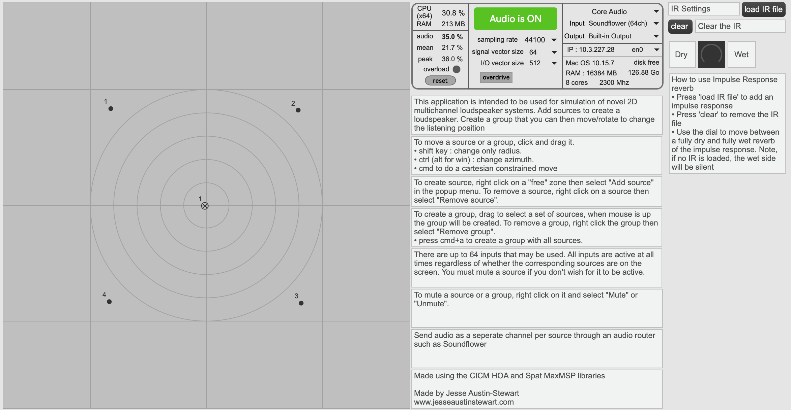
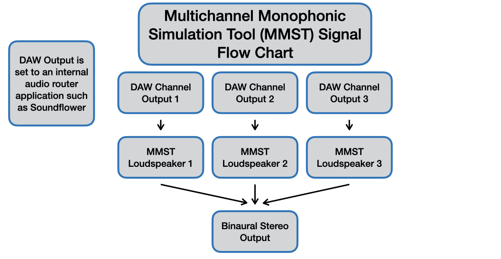
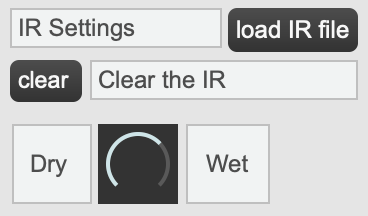

# Introduction

Composing works for novel multichannel systems has various limitations. Spatial audio predominantly relies on the use of stereophony and stereophonic spatial methods that privilege the sweet spot listening position. The sweet spot requires accurate positioning of loudspeakers in order to realize an unbroken phantom image so that listeners can perceive an accurate spatial picture (Kendall 2010; Ratcliff 1974). Beyond the technical, there are also a number of social and hearing related issues associated with the sweet spot (Composer One 2020; Composer One and Composer Two 2021; Composer Two 2020). Because of these issues, previous work has been done to establish a compositional framework, entitled the *Multichannel Monophonic Compositional Framework*, which gives composers compositional strategies to create non-sweet spot oriented spatial music (Austin-Stewart and Johnson 2020). The results from test cases of this compositional strategy framework have determined that for audiences, the framework is effective in achieving its intention. While this is the case, composer feedback expressed difficulty in creating non-sweet spot music for a novel loudspeaker array when not given the opportunity to both work with the loudspeaker array and the space in which the loudspeaker array would be situated within.

Presented in this article is a tool designed to address the issues of composers being unable to accurately simulate novel 2D loudspeaker arrays and the acoustic space that they are within: the *Multichannel Monophonic Simulation Tool*. This is an application that has been designed to allow composers to simulate any array with up to 64 loudspeakers in a two-dimensional plane while also approximating the effect of that array’s acoustic space. The use of this application will allow composers to more fully realize their compositional intentions when writing for a loudspeaker array that they don’t have access to—in particular when it is a novel array.

This article will begin by establishing the issues present with the sweet spot before addressing the ways in which the *Multichannel Monophonic Compositional Framework* seeks to addresses these issues. It will then look at composer feedback of the framework to understand the need for an application to assist one’s spatial understanding of the loudspeaker array and its acoustic space. A review of current spatial applications is presented which discusses whether or not the current applications that exist could address the issues of composers before finally detailing the newly devised *Multichannel Monophonic Simulation Tool*. This paper reports on an iterative step in the development of a compositional rpactice that does not employ intensity panning for spatialisation.

# Issues with the Sweet Spot, the *Multichannel Monophonic Compositional Framework* and its evaluation

The sweet spot listening position is reliant on loudspeakers being positioned equidistantly in relation to each other and the listener in order for a phantom image to be correctly perceived (Kendall 2010). If the angle of the loudspeakers is too great, then there is risk of the phantom image being broken (Ratcliff 1974). Additionally, even minimal movement outside of the sweet spot can have a significant effect on the spatial image—a horizontal shift of 0.335 metres in relation to the loudspeaker array will cause an arrival time difference of 1 ms between the loudspeakers, with the phantom image shifting towards the loudspeaker leading in time (Kendall 2010). Beyond these technical issues associated with the sweet spot, there are also social and hearing-related issues.

Three spatial audio composers were interviewed and expressed discomfort with taking a sweet spot listening position for a variety of reasons. Two of the composers interviewed were composers who wrote works using the aforementioned *Multichannel Monophonic Compositional Framework* and one was a composer who is hard of hearing and was interviewed in relation to their experience with spatial audio and their hearing. Some expressed social discomfort and feeling as if you were taking a privileged listening position.

“When I have attended a concert (even when encouraged to sit in the middle by the composer themself), I will usually allow others to get to the "sweet spot" first before I find my seat. … [This is due to] social anxiety. I am sure many young artists would feel when in a room with better known or older artists. I am more likely to stick to the sides or the back of the performance space because I wish to experience the music in anonymity and peace; I do not want to talk to anyone or have my experience influenced by their presence, chatter/conversation, or the thought that I will need to make conversation with them after” (Spatial Audio Composer 1 2021a:1)

Another composer added: “It would be common for me to sit outside of the sweet spot for multiple reasons, and I would definitely feel like I’m taking a privileged position by sitting in the middle. This means I’ve listened to multiple performances from outside of an octophonic array, as there were too many people to fit within the ring. During these works, I would end up having an experience of the work that most likely didn’t quite equate to what the composer intended in terms of spatial movement… I don’t want to take that privileged spot from someone else, especially if they have more investment in the work than I do” (Spatial Audio Composer 3 2021c:3, 2021d:3).

Beyond these social issues, another composer expressed issue with how the sweet spot relies on listeners not being hard of hearing or d/Deaf. 

“My reluctance to move nearer the sweet spot does at least partially stem from a level of discomfort with approaching a professional during multichannel listening. There are two reasons for this. First, their reputation and sense of authority… makes it difficult to relate to them in a casual setting… Second, my hearing difficulties do make it hard to risk discussion. What if they hear some-thing I don't? What if they ask me about this and I couldn't hear anything? It is much less risky if I just ensure I have a different listening experience” (Spatial Audio Composer 2 2021b:2).

These three composer responses demonstrate that beyond the technical issues associated with the sweet spot, there are also social barriers and barriers of hearing. It is upon these collective barriers that the *Multichannel Monophonic Compositional Framework* was conceived.

The *Multichannel Monophonic Compositional Framework*, developed by the first author, is a framework that consists of a variety of spatio-compositional strategies that do not employ intensity panning. It aims to allow for the creation of spatial audio experiences that are equally intended from multiple positions regardless of where you are situated within the array. It is intended for use with channel-based loudspeaker arrays [^1], where loudspeakers can be addressed individually and discretely. The framework was devised through a review of spatial compositional strategies, where the methods that relied on stereophonic spatialisation were removed. This resulted in the inclusion of the spatial methods of spatial allusion (Barrett 2002), spatial movement (Baalman 2010), timbre spatialisation (Normandeau 2009), temporal nature of space (Barrett 2002; Wishart 1985), localization characteristics of varying types of sonic material (Barrett 2002; Blauert 1996; Hartmann 1983; Rakerd and Hartmann 1986), and loudspeaker system design and system selection (Austin-Stewart and Johnson 2021). This framework was then sent to seven composers to write works for a novel array that didn’t have a sweet spot and was comprised of 12 loudspeakers. The composers were not told where the loudspeakers would be positioned and only told the number of speakers, as to make sure that that didn’t attempt any stereophonic spatial movement. These were there presented in the installation *Multiple Monophony* (Austin-Stewart  2021b). Additionally the first author also used the framework for the installation *four swinging speakers* (Austin-Stewart 2021b). Audience surveys were collected from both events and composer surveys were collected from *Multiple Monophony* (a composer survey wasn’t collected from four swinging speakers as the work was by the first author).

[^1]: A channel-based array is one that lets you address the loudspeakers individually by sending material to specific loudspeakers. For example, 5.1 would be considered a channel-based array, however, if you were decoding a B-Format recording to 5.1, it would not allow for channel based spatialisation. Additionally, systems such as wave field synthesis are not channel based.

## Audience Evaluation of the Framework

During the time these works were exhibited, the audience was surveyed to determine the effectiveness of the framework from their perspective. Relevant respondents from the *Multiple Monophony* and *four swinging speakers* audience surveys were respondents who had attended 6+ spatial concerts/events/installations in the preceding two years and who identified the regularity of their attendance at spatial concerts/events/installations as either ‘semi-regularly’ or ‘as much as possible’. They also listened to the installation from multiple positions and had said that in previous spatial concerts/events/installations they perceived that they had had ‘an inferior or less intended spatial experience because of where [they] were positioned in the room’. This criterion determined firstly that these relevant responders are well-versed and engaged with spatial audio and can make comparisons to other spatial audio events. They also listened from multiple positions so can determine whether or not there was a listening position they perceived as more spatially interesting. Lastly, having previously had an ‘inferior or less-intended’ spatial experience because of where they were in the room means that they can compare that experience to their experience in these two installations.

In the case of *Multiple Monophony* and *four swinging speakers*, based on the responses from the relevant responders, the framework could be deemed successful in creating spatially aesthetically non-sweet spot oriented spatial experiences that are seen as equally interesting from multiple positions in the room. Additionally, there weren’t any cases where the audience determined they had had an inferior listening experience because of their listening position. The survey responses have been further elaborated in the following citation (Austin-Stewart and Johnson 2020).

From an audience perspective in the test uses of the framework, it has been successful at removing the sweet spot without losing spatial interest. While this is the case, it doesn’t address how the composers felt about the compositional process and how their works translated to the novel loudspeaker array.

## Composer Evaluation of the Framework

After the completion of the installation of *Multiple Monophony* the seven composers were sent five recordings (recorded in B-format and decoded to binaural) of their works from different positions within the room and a survey asking them to respond to their experience composing with the framework and their impression of the end result of their work, as heard through the recordings. Evaluating the pieces as recordings of the works (particularly binaural recordings) is less than ideal, though, due to the geographic diversity of the composers, it was the only method that allowed for consistency of evaluation.

A majority of the composers felt the recordings of their works were representative of their spatial intentions, though those who didn’t feel that way, felt they did not anticipate the effect of the acoustics of the space. A majority of the composers also found their works spatially interesting, that all the recordings were equally representative of their spatial intentions., and that the spatial aesthetic was equally interesting from multiple positions. The sound of the room had quite an impact on their work, with 4/7 composers commenting on the effect it had and the difference between the resultant work and their intended result. Some composers also expressed it was difficult imagining what the end result would be.

While these responses suggest that composers on average found the recordings of *Multiple Monophony* showed the works as aesthetically spatially interesting from multiple positions and that the works were representative of their spatial intentions, we can also see how some composers expressed difficulty with the compositional situation they were placed in. Being unable to work with the array and being unable to properly understand the acoustic space of the installation resulted in the majority of composers commenting that the resultant work was different from what they anticipated. Even if the composers were aware of the array configuration, the current spatial simulation applications available wouldn’t have appropriately helped them simulate the array used in *Multiple Monophony*. This will be further addressed in the next section.

From a listener’s and composer’s perspective, the *Multichannel Monophonic Compositional Framework* is successful at creating spatially aesthetically non-sweet spot oriented spatial experiences that are seen as equally interesting from multiple positions in the room. While this is the case, it is also illustrated that the compositional situation that the composers found themselves in did not allow them to create a work that they fully anticipated. Because of this, technology must be created to address this issue.

# *Multichannel Monophonic Simulation Tool*

The *Multichannel Monophonic Simulation Tool* is an application that has been devised in order to address the issues of not being able to work with a loudspeaker array when composing and not being able to work with the array within the space it will be installed.

There are various reasons why an individual may not be able to write with a multichannel array in the intended performance space. The array may only be set up for a small period of time, limiting the access individuals have to it. If the array is within a shared space, such as a university, it may also be in high demand. Additionally, individuals may not have space or the economic capital required to set up the array to work on within their home or personal studio. The reasons why someone may not have access to an array are also not limited to these. To combat this limited access to multichannel arrays, a variety of applications have been devised so that individuals may simulate multichannel systems for stereo playback. This allows individuals to write for a system they may have limited or no access to before having a work performed by that system, while still having a representative understanding of how the work will sound.

While this is the case, the applications currently devised have limitations either of price, technical knowledge, or application features when trying to simulate novel 2D arrays, such as the one used for *Multiple Monophony*. One must review the applications that currently exist to understand what needs to be devised to address the issues composers had within *Multiple Monophony* of not being able to simulate the array and acoustic space.

## Spatial Application Review

There are various applications that have been developed so one can simulate a multichannel system over headphones or stereo speakers. Based off the issues presented by the composers and issues of price, technical knowledge, and application features, an ideal application would meet the following criteria:

* Be cheap/free
* Allow for a high channel number for custom channel-based arrays (above eight loudspeakers)
* Allow the user to change listening position within the array
* Relatively easy to use
* Allows you to simulate the reverb of an acoustic space (has an IR reverb)

An application that fits these criteria would have allowed the composers for Multiple Monophony to simulate the acoustic space and loudspeaker array layout while not costing them much and being relatively easy to use. It would have also allowed them to simulate the work from multiple listening positions to see if any listening positions felt inferior. The following review will determine if such an application exists and if not, where the gaps in the field are.

There are a variety of applications that have been devised to decode B-Format audio to stereo or binaural for some fixed configurations. These applications range in price and include Harpex-B (€298) (Harpex-B 2011), ATK (free) (The Ambisonic Toolkit 2015), Soundfield by RØDE (free) (SoundField by RØDE 2018), and Envelop 4 Live (free) (Envelop 4 Live 2018). In addition to varying in price, these applications also vary in use, with Envelop 4 Live only being able to be used in Ableton Live. Similarly, the ATK suite can only be used in Reaper or SuperCollider. 

These plugins are not and exhaustive list of B-Format decoders, but illustrate a range of price and usage contexts to provide an understanding of the field. In the case of all of these B-Format decoders, they only decode to a set of fixed arrays and only do so for a fixed listening position (the sweet spot). Unfortunately, these plugins would not be useful when trying to compose for an array outside of the arrays that these plugins support, and as they are B-Format decoders, they would not be much assistance in channel-based compositional approaches, such as the ones the Multichannel Monophonic Compositional Framework are based on. Looking beyond B-Format decoders, there are various applications that allow for more extended spatialisation simulation. 

IEM Suite’s AllRADecoder (AllRADecoder 2018) is a free plugin that allows a user to decode B-Format audio to any custom designed array. The user needs to enter the co-ordinates of the various loudspeakers within the novel array, and it will decode the B-Format audio for that array. This plugin has no barrier of cost, however, it does not allow one to try channel based approaches. It also centres the listening position around a sweet spot. It is somewhat easy to use, but does not allow for the simulation of the reverb of an acoustic space.

Spat Revolution (USD $399) and Spat Revolution Ultimate (USD $1,995) (Spat Revolution 2019) allow for custom arrays for channel based, binaural, and ambisonic systems. The cheaper Spat Revolution allows for the simulation of 12 channel custom arrays, with Spat Revolution Ultimate allowing for the simulation of 64 channel custom arrays. With both applications, a user can vary the listening position. While Ultimate allows for creation of custom arrays with a large number of channels, it is incredibly cost prohibitive. It is not relatively easy to use and does not allow for the simulation of the reverb of an acoustic space.

New Audio Technology’s Spatial Audio Designer (€389) (Spatial Audio Designer 2013) allows for custom arrays and channel based systems. The online and user documentation is limited, but it suggests one can use up to 330 outputs for custom systems, but does not suggest you can simulate from multiple listening positions. With Spatial Audio Designer, there is a relatively large cost barrier and is not relatively easy to use. It also does not allow for the simulation of the reverb of an acoustic space and doesn’t allow for simulation from multiple listening positions.

The Spat MaxMSP Library (free) (Spat~ 1990) is a library of MaxMSP externals designed specifically for spatialization use cases. The externals can be used by users in the creation of MaxMSP patches that can fulfil their desired spatial use case. Using them to create something to simulate a novel array from multiple listening positions would be possible, especially if used in conjunction with other MaxMSP external libraries such as the CICM HOA Library (HoaLibrary 2012). These libraries allow for all the desired use cases except for being relatively easy to use. The libraries require a lot of technical knowledge of MaxMSP to create the desired patch to fulfil the use case.

In the applications reviewed, together, they tick all of the boxes desired within an application based on the criteria determined earlier in this section.

|                           | B-format Decoders | AllRADecoder | Spat Revolution/Ultimate | Spatial Audio Designer | Spat MaxMSP Library etc |
|---------------------------|-------------------|--------------|--------------------------|------------------------|-------------------------|
| Cheap/Free                | Yes               | Yes          | No                       | No                     | Yes                     |
| High channel number       | No                | Yes          | Yes                      | Yes                    | Yes                     |
| Change listening position | No                | No           | Yes                      | No                     | Yes                     |
| Easy to use               | Yes               | Somewhat     | No                       | No                     | No                      |
| IR Reverb                 | No                | No           | Unclear                  | No                     | Yes                     |
:Table Caption (TODO)

However, as the above table demonstrates, there is no application from the applications reviewed that achieves all of the desired criteria. This this shows a need for the development of an application that *does* achieve all of the desired criteria.

## The Tool

In response to the spatial simulation application review completed above, the *Multichannel Monophonic Simulation Tool* was created. 

The tool developed (Figure 1) is a standalone application, created using the Spat and CICM HOA MaxMSP external libraries (HoaLibrary 2012; (Spat~ 1990)). It allows for the creation of custom channel based arrays for up to 64 loudspeakers, users can listen from multiple positions, it is relatively easy to use, and users can load an impulse response to simulate the reverb of an acoustic space. Additionally, there are Windows and MacOS versions of the application available for free download as standalone applications (as opposed to MaxMSP patches) that can be used regardless of whether you have MaxMSP installed or not (Austin-Stewart 2021c).

### How It Works

The application functions by using the GUI to add loudspeakers to create the 2D array that they wish to simulate. These loudspeakers are then numbered as to the speaker they correspond to. 

To send audio to these speakers, the user needs to use an audio routing application, such as *Soundflower*, as their DAW output device to send audio from their DAW to the application, with the output of the audio channel of their DAW corresponding with the speaker number in the simulation tool. The listening position is the centre position of the GUI. Users can group the speakers together and move the group around the GUI, in effect, changing the listening position. Users can also rotate the speaker grouping to the direction the listener is facing from the listening position. In the top right corner, users have the ability to add an impulse response (as an audio file of the desired acoustic space) to change the acoustic space that is simulated within the tool. By default, it does not simulate an acoustic space. The dry/wet of the impulse response can also be adjusted.

In regards to the tool’s limitations, it doesn’t allow you to specifically position the loudspeakers, but rather approximate their position by clicking and dragging them into position. What this feature loses in specificity makes up for in ease of use [^2]. The application also only allows binaural output. This is useful for simulating the novel systems created in a solo compositional context, but it doesn’t allow for simulation of for larger multichannel systems to quickly translate the novel array devised within the tool to a standardised multichannel system.

[^2] In the case of the first iteration of the *Multichannel Monophonic Simulation Tool*, the priority was ease of use. This resulted in an application that did not have a system built in that allows for the specific positioning of loudspeakers as a 'drag-and-drop' method was deemed most apprpriate by the first author. Subsequent versions of the application may see this added as an additional feature either as a part of the GUI or through loading a text file.

### Application of the Tool

In the case of *Multiple Monophony*, the *Multichannel Monophonic Simulation Tool* would have allowed composers to simulate the novel 2D loudspeaker array that they were composing for. It also would have allowed them to simulate the acoustic space of the installation. Beyond *Multiple Monophony*, the tool will allow users to simulate any 2D channel-based loudspeaker configuration of their choosing of up to 64 loudspeakers. This tool increases the ease of writing for and organising spatial audio events/concerts/installations for works for novel 2D loudspeaker arrays. The ease of customization allows for more certainty when writing for unconventional novel arrays. 

# Future Research

There is scope for evaluation of the tool developed in this paper. Like the surveys completed evaluating the *Multichannel Monophonic Compositional Framework* through audience and composer responses, there is also opportunity to evaluate the tool in the context of its use. The methodology used to gather composer responses may also be adjusted from that of the *Multichannel Monophonic Compositional Framework* to invite the composers to listen to the works in situ. This would provide an appropriate contrast between the simulated environment within the *Multichannel Monophonic Simulation Tool* and the performance environment.

# Conclusion

The sweet spot and sweet spot oriented spatial music bring a complicated mix of exclusion, founded on technical, social, and hearing-related issues. While attempts such as *Multiple Monophony* and the *Multichannel Monophonic Compositional Framework* have been made by the first author to break down the sweet spot listening position, they ultimately resulted in a situation where composers were unable to fully understand the implications of their compositional decisions in regard to the novel loudspeaker array and the acoustic space the array is situated within.

The subsequent spatial application review has led to the *Multichannel Monophonic Simulation Tool* which addresses the issues found through the composer surveys after *Multiple Monophony*. The application itself not only allows users to simulate any 2D channel-based loudspeaker array up to 64 loudspeakers and the acoustic space of which it is in, but it also allows users to change the listening position within the array, is relatively easy to use, and is also free. Through making the process easier to write for custom channel-based arrays, the tool also gives composers more certainty when choosing to work with a non-sweet spot oriented system. This certainty reduces the difficulty in working with non-sweet spot oriented channel-based arrays, and in turn, removes barriers associated with non-sweet spot oriented spatial music. This paper provides oppotunity for future research evaluating the *Multichannel Monophonic Simulation Tool*. This application is one more step towards reducing the technical, social, and hearing-related exclusion caused by the sweet spot.

# References

AllRADecoder (1.13.0). 2018. [Computer software]. IEM. https://plugins.iem.at/docs/allradecoder/

Austin-Stewart, Jesse. 2021a. “Four Swinging Speakers.” YouTube. Retrieved September 4, 2021 (https://www.youtube.com/watch?v=K80xXR9qJto).

Austin-Stewart, Jesse. 2021b. “Multiple Monophony.” YouTube. Retrieved September 4, 2021 (https://www.youtube.com/watch?v=dEspBzyMUek).

Austin-Stewart, J. 2021c. Multichannel Monophonic Simulation Tool (1.0.) [Computer software]. https://www.jesseaustinstewart.com/software

Austin-Stewart, Jesse, and Bridget Johnson. 2020.“Multiple Monophony and the Multichannel Monophonic Framework.” Presented at the Australasian Computer Music Conference, Online.

Austin-Stewart, Jesse, and Bridget Johnson. 2021. “Spatial System Design as a Spatio-Compositional Strategy.” Santiago, Chile (Online).

Baalman, Marije A. J. 2010. “Spatial Composition Techniques and Sound Spatialisation Technologies.” Organised Sound 15(03):209–18. doi: 10.1017/S1355771810000245.

Barrett, Natasha. 2002. “Spatio-Musical Composition Strategies.” Organised Sound 7(3):313–23. doi: 10.1017/S1355771802003114.

Blauert, Jens. 1996. Spatial Hearing:: The Psychophysics of Human Sound Localization. 3rd ed. Cambridge, Massachusetts: The MIT Press.

Composer One. 2020. “Interview by Jesse Austin-Stewart.”

Composer One, and Composer Two. 2021. “Interview by Jesse Austin-Stewart.”

Composer Two. 2020. “Interview by Jesse Austin-Stewart.”

Envelop 4 Live (11.0.1). 2018. [Computer software]. Envelop. https://www.envelop.us/software

Harpex-B (1.6). 2011. [Computer software]. Harpex. https://harpex.net/

Hartmann, William M. 1983. “Localization of Sound in Rooms.” Journal of the Acoustical Society of America 74(5):337–63.

HoaLibrary (2.2). 2012. [Computer software]. HOA Library. http://hoalibrary.mshparisnord.fr/en

Kendall, Gary S. 2010. “Spatial Perception and Cognition in Multichannel Audio for Electroacoustic Music.” Organised Sound 15(03):228–38. doi: 10.1017/S1355771810000336.

Normandeau, Robert. 2009. “Timbre Spatialisation: The Medium Is the Space.” Organised Sound 14(3):277–85. doi: 10.1017/S1355771809990094.

Rakerd, Brad, and William M. Hartmann. 1986. “Localization of Sound in Rooms, III: Onset and Duration Effects.” The Journal of the Acoustical Society of America 80(6):1695–1706.

Ratcliff, P. A. 1974. Properties of Hearing Related to Quadraphonic Reproduction. BBC RD 1974/38. BBC Research Department No. 38.

SoundField by RØDE (1.0.2). 2018. [Computer software]. RØDE. https://en.rode.com/soundfieldplugin

Spat Revolution (20.12). 2019. [Computer software]. Flux Audio. https://www.flux.audio/project/spat-revolution/

Spat~ (5.x). (1990). [Computer software]. IRCAM. https://forum.ircam.fr/projects/detail/spat/

Spatial Audio Designer (3.0). (2013). [Computer software]. New Audio Technology. https://newaudiotechnology.com/products/spatial-audio-designer/

Spatial Audio Composer 1. 2021a. “Interview with Spatial Audio Composer 1 by Jesse Austin-Stewart.”

Spatial Audio Composer 2. 2021b. “Interview with Spatial Audio Composer 2 by Jesse Austin-Stewart.”

Spatial Audio Composer 3. 2021c. “Interview with Spatial Audio Composer 3 by Jesse Austin-Stewart.”

Spatial Audio Composer 3. 2021d. “Interview with Spatial Audio Composer 3 by Jesse Austin-Stewart.”

The Ambisonic Toolkit (1.0. beta 10). 2015. [Computer software]. Ambisonic Toolkit. https://www.ambisonictoolkit.net/

Wishart, Trevor. 1985. On Sonic Art. Harwood Academic Publishers.
